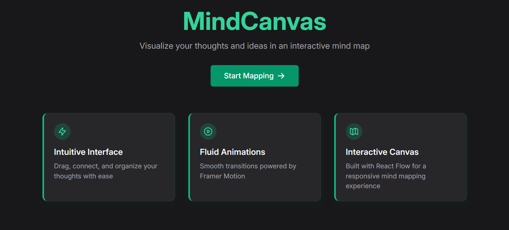
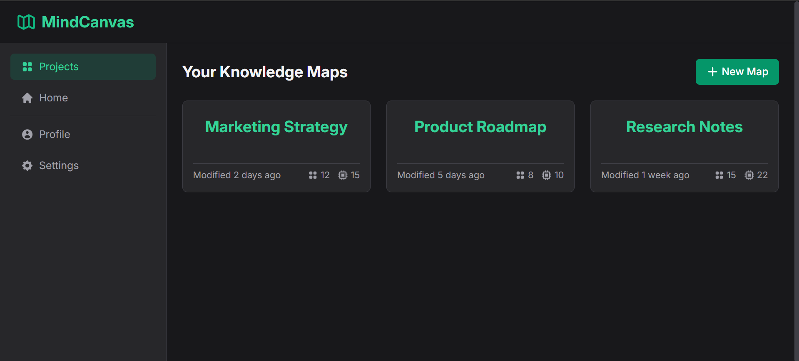
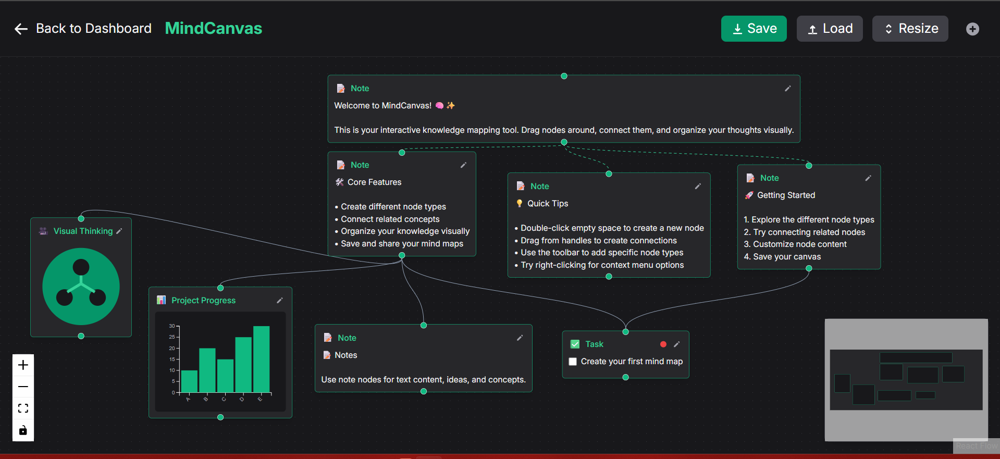

# MindCanvas 🧠✨

<div align="center">
  
  
  <h3>Transform Thoughts into Visual Masterpieces</h3>
  
  <p>A powerful mind mapping and visual thinkin## 📧 Contact

Andry Dubey - [@Andrydubey](https://github.com/Andrydubey)

Project Link: [https://github.com/Andrydubey/MindCanvas](https://github.com/Andrydubey/MindCanvas)

---

<div align="center">
  <p>Made with ❤️ by Andry</p>
</div>t with modern web technologies</p>

  <div>
    
    
    
    
  </div>
</div>

## ✨ Features

- **Interactive Canvas**: Create, edit, and connect nodes with an intuitive interface
- **Multiple Node Types**: Notes, Tasks, Media, and Charts to represent different types of information
- **Beautiful UI**: Clean, modern interface with smooth animations
- **Responsive Design**: Works on desktop and tablet devices
- **Particle Background**: Engaging visual experience with dynamic particle effects

## 🎨 Default Canvas Structure

The default canvas in MindCanvas is structured to provide users with a clear understanding of the tool's capabilities:

```
Welcome to MindCanvas
       |
       ├─────────┬─────────────┐
       ↓         ↓             ↓
Core Features  Getting Started  Quick Tips
       |         |
       ├───┬───┬─┘
       ↓   ↓   ↓   
    Notes Tasks Media
       |    ↑    |
       └────┴────┘
           ↓
        Charts
```

This structure showcases:
- **Central Theme**: The main welcome node introduces the application
- **Key Categories**: Core features, getting started guide, and tips for new users
- **Node Examples**: All four node types (Notes, Tasks, Media, Charts) with their unique features
- **Connection Examples**: Different connection types and styles between related concepts

Users can start with this template and modify it to fit their specific needs or create a completely new canvas from scratch.

## 📸 Screenshots

<div align="center">
  <h3>Home Page</h3>
  
  
  <h3>Dashboard</h3>
  
  
  <h3>Canvas</h3>
  
</div>

## 🚀 Technologies

- **Frontend**: 
  - [React](https://reactjs.org/) - UI component library
  - [React Flow](https://reactflow.dev/) - Node-based UI library
  - [Framer Motion](https://www.framer.com/motion/) - Animation library
  - [TailwindCSS](https://tailwindcss.com/) - Utility-first CSS framework

- **Visualization**:
  - [D3.js](https://d3js.org/) - Data visualization library
  - [React Particles](https://particles.js.org/) - Background particle system

- **Development**:
  - [Vite](https://vitejs.dev/) - Next generation frontend tooling
  - [ESLint](https://eslint.org/) - Code linting

## 🛠️ Getting Started

### Prerequisites

- Node.js (v14 or higher)
- npm or yarn

### Installation

1. Clone the repository
   ```bash
   git clone https://github.com/Andrydubey/MindCanvas.git
   cd MindCanvas
   ```

2. Install dependencies
   ```bash
   npm install
   ```

3. Start the development server
   ```bash
   npm run dev
   ```

4. Open [http://localhost:5173](http://localhost:5173) in your browser

## 🗺️ Project Roadmap

### Phase 1: Foundation (Current)
- ✅ Basic application structure
- ✅ Interactive canvas with React Flow
- ✅ Multiple node types (Notes, Tasks, Media, Charts)
- ✅ Node connections and basic styling

### Phase 2: Core Features (Short-term)
- 🔄 Persistent storage for saving canvases
- 🔄 User authentication system
- 🔄 Canvas templates and presets
- 🔄 Improved node styling and customization
- 🔄 Keyboard shortcuts for improved workflow

### Phase 3: Advanced Features (Mid-term)
- 📅 Collaborative editing capabilities
- 📅 Real-time synchronization
- 📅 Advanced export options (PDF, PNG, SVG)
- 📅 Custom themes and visual styles
- 📅 Advanced search and filtering

### Phase 4: Expansion (Long-term)
- 🔮 Mobile application
- 🔮 AI-assisted mind mapping
- 🔮 Integration with third-party tools (Notion, Trello)
- 🔮 Custom plugins and extensions system
- 🔮 Advanced data visualization options

### Phase 5: Enterprise (Future)
- 💼 Team collaboration features
- 💼 Advanced permission management
- 💼 Enterprise authentication (SSO)
- 💼 Analytics and insights
- 💼 Custom deployment options

## 📁 Project Structure

```
MindCanvas/
├── public/               # Static assets and images
├── src/
│   ├── assets/           # Images, fonts, and media files
│   ├── components/       # Reusable UI components
│   │   ├── nodes/        # Different node type components
│   │   └── ...           # Other components
│   ├── hooks/            # Custom React hooks
│   ├── pages/            # Page components
│   │   ├── Canvas.jsx    # Main canvas editor
│   │   ├── Dashboard.jsx # Project dashboard
│   │   ├── Home.jsx      # Landing page
│   │   └── NotFound.jsx  # 404 page
│   ├── styles/           # CSS and styling
│   ├── utils/            # Helper functions
│   ├── App.jsx           # Main app component
│   └── main.jsx          # Entry point
├── docs/                 # Documentation
│   ├── canvas-guide.md   # Guide for using the canvas
│   └── development-roadmap.md # Detailed development plans
├── index.html            # HTML template
└── package.json          # Dependencies and scripts
```

## 🧩 Node Types

MindCanvas supports multiple types of nodes to help you visualize your thoughts:

- **Note Nodes**: Simple text notes for ideas and thoughts
- **Task Nodes**: To-do items with completion status
- **Media Nodes**: Images, videos, and other media content
- **Chart Nodes**: Data visualization for numeric information

## 📝 Development Guide

### Adding a New Node Type

1. Create a new component in `src/components/nodes/`
2. Register the node type in the Canvas component
3. Add styling using TailwindCSS classes

### Custom Animations

Use Framer Motion to add smooth animations to your components:

```jsx
import { motion } from 'framer-motion';

const MyComponent = () => (
  <motion.div
    initial={{ opacity: 0 }}
    animate={{ opacity: 1 }}
    transition={{ duration: 0.5 }}
  >
    Content goes here
  </motion.div>
);
```

## 🏗️ Building for Production

```bash
npm run build
```

This will create a `dist` folder with an optimized production build.

## 🤝 Contributing

Contributions are welcome! Please feel free to submit a Pull Request.

1. Fork the project
2. Create your feature branch (`git checkout -b feature/amazing-feature`)
3. Commit your changes (`git commit -m 'Add some amazing feature'`)
4. Push to the branch (`git push origin feature/amazing-feature`)
5. Open a Pull Request

## 📄 License

This project is licensed under the MIT License - see the LICENSE file for details.

## 📧 Contact

Khushi Pandey - [@khushipandey_15](https://github.com/khushipandey-15)

Project Link: [https://github.com/khushipandey-15/MindCanvas](https://github.com/khushipandey-15/MindCanvas)

---

<div align="center">
  <p>Made with ❤️ by Khushi Pandey</p>
</div>
